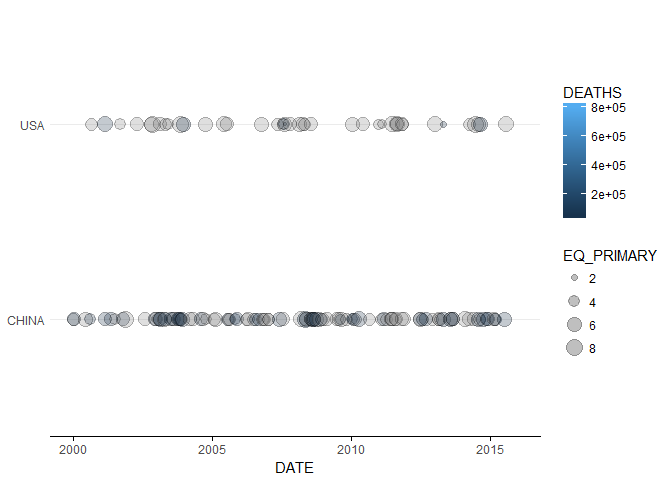

<!-- README.md is generated from README.Rmd. Please edit that file -->

# earthquakes

The earthquakes package is created for the Mastering Software
Development in R capstone from coursera.

This capstone project will be centered around a dataset obtained from
the U.S. National Oceanographic and Atmospheric Administration (NOAA) on
significant earthquakes around the world. This dataset contains
information about 5,933 earthquakes over an approximately 4,000 year
time span.

The overall goal of the capstone project is to integrate the skills you
have developed over the courses in this Specialization and to build a
software package that can be used to work with the NOAA Significant
Earthquakes dataset. This dataset has a substantial amount of
information embedded in it that may not be immediately accessible to
people without knowledge of the intimate details of the dataset or of R.
Your job is to provide the tools for processing and visualizing the data
so that others may extract some use out of the information embedded
within.

The ultimate goal of the capstone is to build an R package that will
contain features and will satisfy a number of requirements that will be
laid out in the subsequent Modules. You may want to begin organizing
your package and insert various features as you go through the capstone
project.

Dataset

  - [NOAA Significant Earthquake
    Database](https://www.ngdc.noaa.gov/nndc/struts/form?t=101650&s=1&d=1)

## Installation

You can install earthquakes from github with:

``` r
# install.packages("devtools")
devtools::install_github("raggaraluz/mastering_r_capstone")
```

## Example

### Downloading data

Data can be downloaded from NOAA Significant Earthquake Database as TSV
and converted to a data frame:

``` r
library(readr)

location <- 'https://www.ngdc.noaa.gov/nndc/struts/results?type_0=Exact&query_0=$ID&t=101650&s=13&d=189&dfn=signif.txt'
raw <- read_tsv(location)
```

Then, the dataframe can be cleaned using the earthquakes package
functions

``` r
library(earthquakes)
library(dplyr)
clean <- eq_clean_data(raw) %>%
  eq_location_clean()

knitr::kable(clean %>%
               select(DATE, LATITUDE, LONGITUDE, LOCATION_NAME, EQ_PRIMARY) %>%
               tail)
```

| DATE       | LATITUDE | LONGITUDE | LOCATION\_NAME | EQ\_PRIMARY |
| :--------- | -------: | --------: | :------------- | ----------: |
| 2018-01-11 |   33.764 |    45.749 | Kermanshah     |         5.5 |
| 2018-01-14 | \-15.776 |  \-74.744 | Arequipa       |         7.1 |
| 2018-01-23 |  \-7.196 |   105.918 | Java: Banten   |         6.0 |
| 2018-01-23 |   56.046 | \-149.073 | Kodiak Island  |         7.9 |
| 2018-01-31 |   36.543 |    70.816 | Baluchistan    |         6.1 |
| 2018-02-06 |   24.174 |   121.653 | Hualien        |         6.4 |

## Timeline geoms

In this package are available two geoms that can be used to plot
earthquake data.

The first geom, `geom_timeline()` is used for plotting a time line of
earthquakes ranging from xmin to xmax dates, with a point for each
earthquake. Optional aesthetics include color, size and alpha. The x
aesthetic is a date and an optional y aesthetic is a factor indicating
some stratification for multiple lines.

``` r
library(ggplot2)
library(lubridate)
clean %>%
  filter(COUNTRY %in% c('USA', 'CHINA')) %>%

  ggplot(aes(x = DATE, y = COUNTRY, size=EQ_PRIMARY, fill = DEATHS)) +
    geom_timeline(alpha = 0.25, xmin = ymd('2000-01-01'), xmax = ymd('2015-12-31')) +
    theme_minimal() + theme(panel.grid.minor.x = element_blank(),
                            panel.grid.major.x = element_blank(),
                            axis.line.y = element_blank(),
                            axis.title.y = element_blank(),
                            axis.line.x = element_line(),
                            axis.ticks.x = element_line())
```

<!-- -->

## Maps

There is a function called eq\_map() that takes an argument data
containing the filtered data frame with earthquakes to visualize. The
function maps the epicenters (LATITUDE/LONGITUDE) and annotates each
point with in pop up window containing annotation data stored in a
column of the data frame. The user should be able to choose which column
is used for the annotation in the pop-up with a function argument named
annot\_col. Each earthquake should be shown with a circle, and the
radius of the circle should be proportional to the earthquake’s
magnitude (EQ\_PRIMARY). One example of this function is:

``` r
clean %>%  
  filter(COUNTRY == "MEXICO" & year(DATE) >= 2000) %>% 
  eq_map(annot_col = "DATE")
```

 In this case, the image is static,
but it is a full interactive map in R.

Finally a function called eq\_create\_label() is available, so that it
takes the dataset as an argument and creates an HTML label that can be
used as the annotation text in the leaflet map. This function puts
together a character string for each earthquake that will show the
cleaned location (as cleaned by the eq\_location\_clean() function
created in Module 1), the magnitude (EQ\_PRIMARY), and the total number
of deaths (TOTAL\_DEATHS), with boldface labels for each (“Location”,
“Total deaths”, and “Magnitude”). If an earthquake is missing values
for any of these, both the label and the value should be skipped for
that element of the tag. The resulting code is:

``` r
clean %>% 
  filter(COUNTRY == "MEXICO" & year(DATE) >= 2000) %>% 
  mutate(popup_text = eq_create_label(.)) %>% 
  eq_map(annot_col = "popup_text")
```


 Again, the image is static, but
it is a full interactive map in R.
